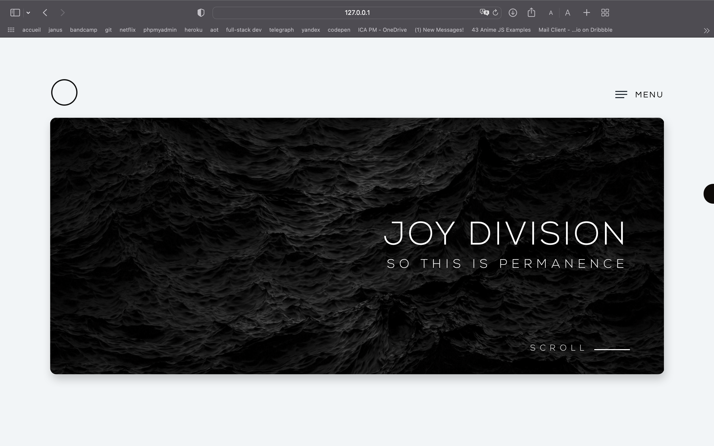
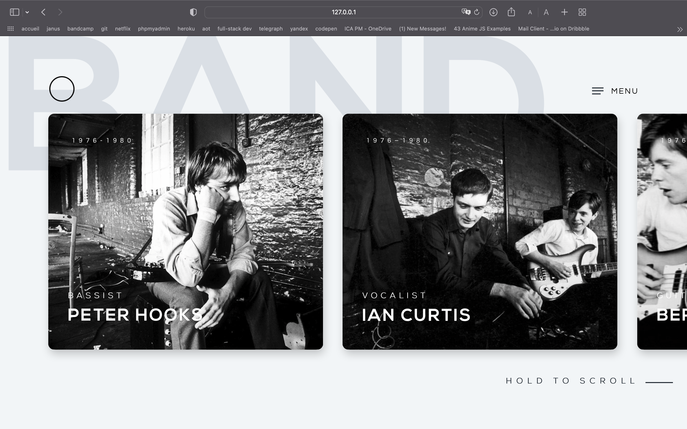
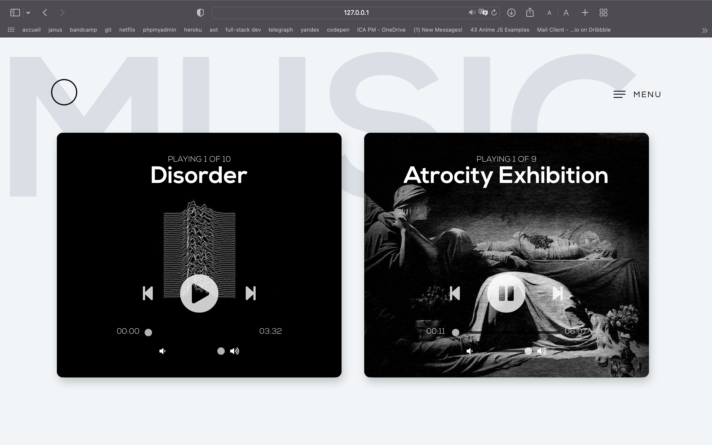
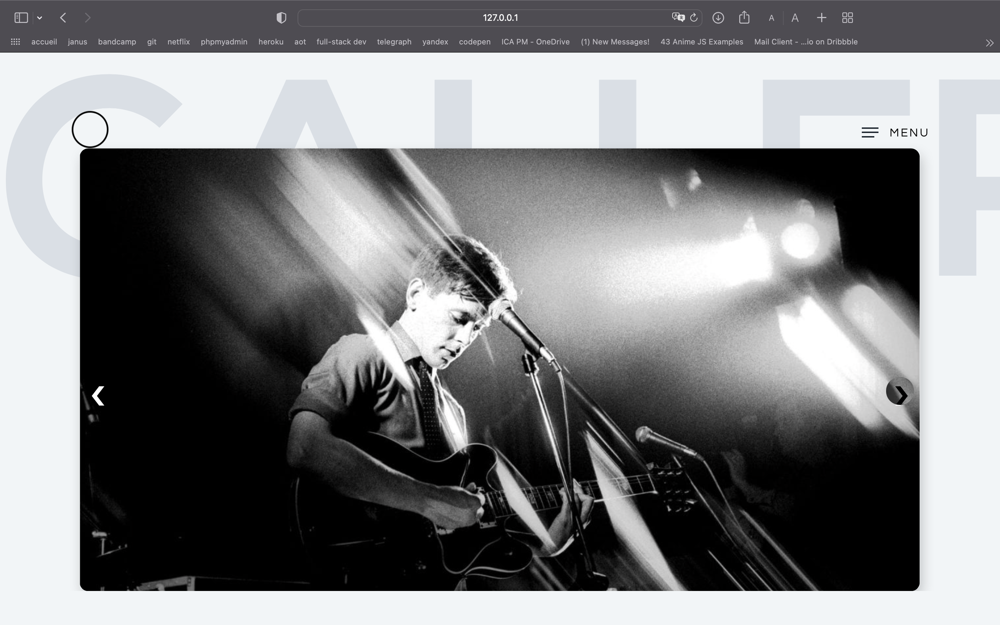
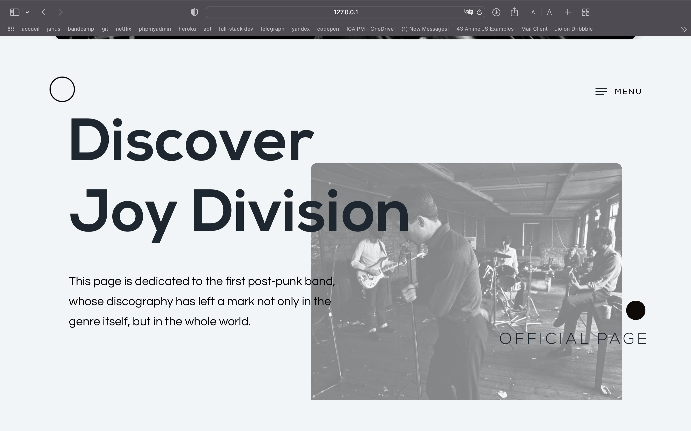

# Joy Division Project #

JavaScript libraries such as Anime and SlickScroll, as well as JSON format data were used in this project for faster and more convenient modification.

I had to use links for audio, as there was a size limit on the allowed file on the Moodle. I hope they will work

There is also a drive with screenshots and a video demonstration of the site :
https://drive.google.com/drive/folders/1oxNqtjl8kBe4zkYXhAelg6rgX7LzOG-W?usp=sharing

